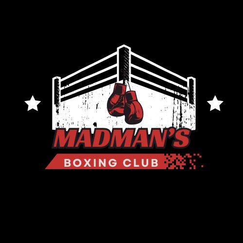

<a name="readme-top">

<br/>

<br />
<div align="center">
  <a href="https://github.com/ANTONIO-JUAN-MIGUEL/AD-Task-1">
  <!-- TODO: If you want to add logo or banner you can add it here -->
    
  </a>
<!-- TODO: Change Title to the name of the title of your Project -->
  <h3 align="center">Madman's Boxing Basics</h3>
</div>
<!-- TODO: Make a short description -->
<div align="center">
  A guide on boxing's basic fundamentals and techniques.
</div>

<br />

<!-- TODO: Change the zyx-0314 into your github username  -->
<!-- TODO: Change the WD-Template-Project into the same name of your folder -->


[]

---

<br />
<br />

<!-- TODO: If you want to add more layers for your readme -->
<details>
  <summary>Table of Contents</summary>
  <ol>
    <li>
      <a href="#overview">Overview</a>
      <ol>
        <li>
          <a href="#key-components">Key Components</a>
        </li>
        <li>
          <a href="#technology">Technology</a>
        </li>
      </ol>
    </li>
    <li>
      <a href="#rule,-practices-and-principles">Rules, Practices and Principles</a>
    </li>
    <li>
      <a href="#resources">Resources</a>
    </li>
  </ol>
</details>

---

## Overview

<!-- TODO: To be changed -->
<!-- The following are just sample -->

A boxing tutorial website built with PHP that teaches fundamental punches (jab, straight, hook, uppercut), fighting stances (orthodox, southpaw, square), and showcases the Slugger/Brawler fighting style through an immersive black/red combat-themed interface.

### Key Components

<!-- TODO: List of Key Components -->
<!-- The following are just sample -->

- Punch technique guides with images

- Stance breakdowns with visual examples

- Fighting style showcase

- Responsive design with hover animations

### Technology

<!-- TODO: List of Technology Used -->
#### Language


## Rules, Practices and Principles

<!-- Do not Change this -->

1. Always use `AD-` in the front of the Title of the Project for the Subject followed by your custom naming.
2. Do not rename `.php` files if they are pages; always use `index.php` as the filename.
3. Add `.component` to the `.php` files if they are components code; example: `footer.component.php`.
4. Add `.util` to the `.php` files if they are utility codes; example: `account.util.php`.
5. Place Files in their respective folders.
6. Different file naming Cases
   | Naming Case | Type of code         | Example                           |
   | ----------- | -------------------- | --------------------------------- |
   | Pascal      | Utility              | Accoun.util.php                   |
   | Camel       | Components and Pages | index.php or footer.component.php |
8. Renaming of Pages folder names are a must, and relates to what it is doing or data it holding.
9. Use proper label in your github commits: `feat`, `fix`, `refactor` and `docs`
10. File Structure to follow below.

```
AD-Task-2/
├── assets/
│   ├── css/
│   │   └── style.css (Main styles)
│   └── img/
│       ├── box.jpg
│       ├── jab.jpg
│       ├── straight.jpg
│       ├── hook.jpg
│       ├── uppercut.jpg
│       ├── slugger-style.jpg
│       ├── orthodox.jpg
│       ├── southpaw.jpg
│       ├── square.jpg
│       └── madman.jpg
│
├── components/
│   └── navigation.component.php
│
├── utils/
│   └── config.util.php
│
├── page/ 
│   ├── assets/
│   │   └── css/
│   │       └── style.css (Page-specific styles)
│   └── index.php
│
├── vendor/ (Composer dependencies)
│   ├── autoload.php
├
├── index.php (Home page)
├── bootstrap.php
├── router.php
├── composer.json
├── composer.lock 
├── .gitignore 
└── README.md
```
> The following should be renamed: name.css, name.js, name.jpeg/.jpg/.webp/.png, name.component.php(but not the part of the `component.php`), Name.utils.php(but not the part of the `utils.php`) bghh

## Resources

<!-- TODO: Add References -->

| Title        | Purpose                                                                       | Link                           |
| ------------ | ----------------------------------------------------------------------------- | ------------------------------ |
| W3Schools    | Learning mainly php, css stylings and themes, especially gradients.           | https://www.w3schools.com/Css/ |
| Chatgpt      | Assisted with code structure, PHP logic implementation, and troubleshooting.  | https://chatgpt.com/           |
| Deepseek     | Provided template references and helped optimize CSS animations.              | https://www.deepseek.com/      |
| Youtube      | Php and css tutorials. Tips and Tricks.                                       | https://www.youtube.com/       |
